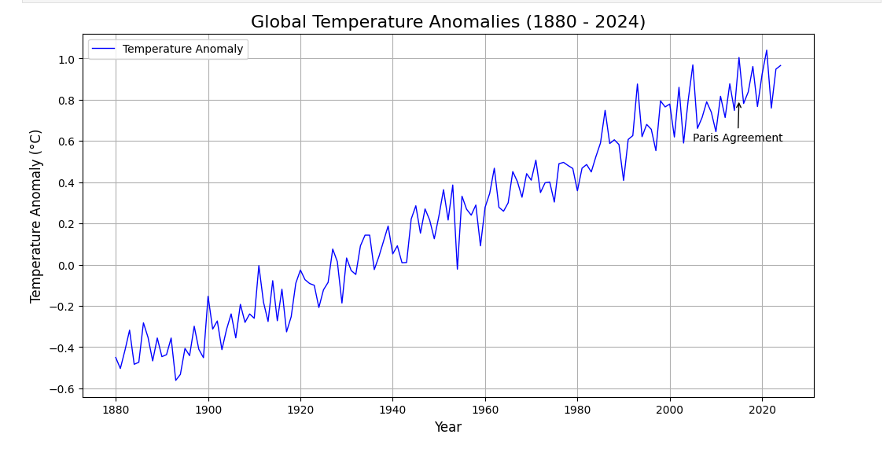

# Climate-Data-Visualization

## Project Overview
This project analyzes global temperature anomalies from 1880 to 2024. Using Python, we explore historical trends, identify key milestones, and highlight the impact of events like the Paris Agreement. The goal is to visualize global warming trends and provide insights into how industrialization and climate policies have shaped temperature patterns over time.

## Objectives
- **Visualize** global temperature anomalies from 1880 to 2024.
- **Identify** long-term warming trends using rolling averages.
- **Compare** warming rates before and after 1950.
- **Highlight** significant climate-related events, such as the Paris Agreement.

## Data Source
- **Dataset**: Generated dataset based on global temperature anomalies.
- **Structure**: Year of observation (1880–2024).
- **Summary**:
  - 145 entries with no missing values.
  - Mean anomaly: 0.212°C.
  - Max anomaly: 1.041°C (warmer than baseline).
  - Min anomaly: -0.561°C (cooler than baseline).

## Findings
### Long-Term Trends
- **Early years (1880–1900)**: Predominantly show negative anomalies, indicating cooler-than-average temperatures.
- **Recent decades**: Consistently show positive anomalies, with 2024 reaching a peak anomaly over 1°C.

### Warming Rates
- **Pre-1950 warming rate**: ~0.0082°C per year.
- **Post-1950 warming rate**: ~0.0097°C per year.
  - **Insight**: Post-1950 warming is faster, likely driven by industrialization and increased greenhouse gas emissions.

### Key Events
- **The Paris Agreement (2015)**: Highlighted as a key climate policy milestone.
- **Persistent warming trends**: Over the past 50 years.

## Visualizations

### 1. Global Temperature Anomalies (1880–2024)

### 2. Global Temperature Anomalies with Rolling Average

### 3. Temperature Anomalies Over Last 50 Years (1975–2024)

## Conclusion
This project demonstrates a clear global warming trend, with significant acceleration post-1950. The findings emphasize the importance of policy interventions, such as the Paris Agreement, in mitigating climate change. Continued monitoring and analysis of temperature anomalies are crucial for understanding the effectiveness of climate actions.

